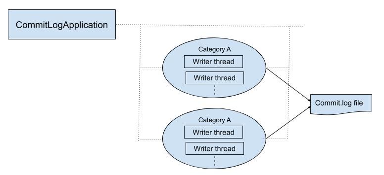
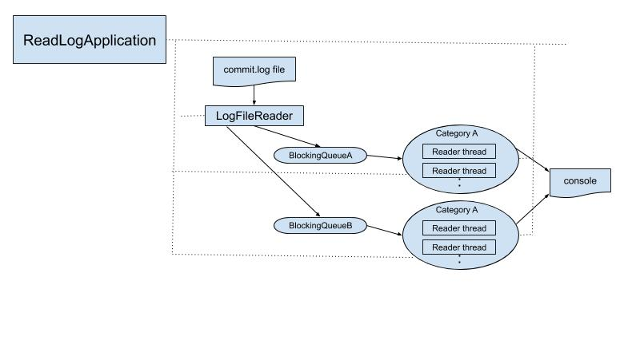

# Overview
[](https://travis-ci.org/gpottepalem/java-multi-threading)

[](https://github.com/gpottepalem/java-multi-threading/actions)

This is a simple Java project containing two Java applications that can be run independently. Leverages some of the
multi-threading capabilities supported in Java.

---
> Author: Giri Pottepalem
---
## 1. CommitLogApplication

Writes log messages to `commit.log` file with the support of configurable multiple writer threads of two categories: 
`A` and `B`.



### Assumptions
* Requires application configuration file: `application.properties`.
* The configuration file must have the following keys and values.
  * `A = n #n is the number of commit writers of category A`
  * `B = n #n is the number of commit writers of category B`
  * `name = commit.log #name of the log file`
* Each writer is a separate thread and writes random number of log messages to the file during it's life.
* The order of log messages is not guaranteed.
* `CID`: a unique log message id number is unique across all writer threads starting with `101`
* A sample log message format is:
```
<writer-threead-category>: <cid>: <message string> :<writer-thread-name>

e.g. log message written to the log file
B: 114: sample log by LogWriter :writer-thread-B3
```

## 2. ReadLogApplication

Reads log messages from from `commit.log` file with the support of configurable multiple reader threads that print 
log messages to the console .



### Assumptions
* Requires the existence of `commit.log` file to read log messages from.
* Each reader thread gets a log message written by the writer thread of the same category:`A` or `B`. This act of
connecting specific category(e.g.`B`) of writer threads to the same category of reader (e.g.`B`) threads is co-ordinated
by `LogFileReader` which leverages `java.util.concurrent.BlockingQueue` in doing so.
* The order of console output of log messages is not guaranteed. The messages don't get shown in the same order that 
they appear in the `commit.log` file.
* A sample log message read is outputted with reader thread appended at the end to verify that the same category of a 
reader thread read the message written a writer thread.
```
<log-message :<reader-thread-name>

e.g. log message read and outputted to the console
B: 114: sample log by LogWriter :writer-thread-B3 :reader-thread-B1
```

## Source Files
All Java source files are under `src/main/java` in the package `com.interactions.log`

All unit test specification files are under `src/test/groovy` in the package `com.interactions.log`

## Installation
Nothing really is needed. Simply `unzip` the zip file into any directory. Once unzipped, `cd interactions` and follow
the instructions to run the apps using convenient gradle tasks provided.

## Running an App
Simply run the following command from the main project directory:   
`./gradlew runCommitLogApp` to run the `CommitLogApplication`
`./gradlew runReadLogApp` to run the `ReadLogApplication` 

## Unit Tests
### Running
Simply run the following command from the main project directory to run all unit tests:   
`./gradlew clean test`

### Test Reports
Simply run the following command from the main project directory or point your browser to the following
`build/reports/...` directory:  
`open ./build/reports/tests/test/index.html` 